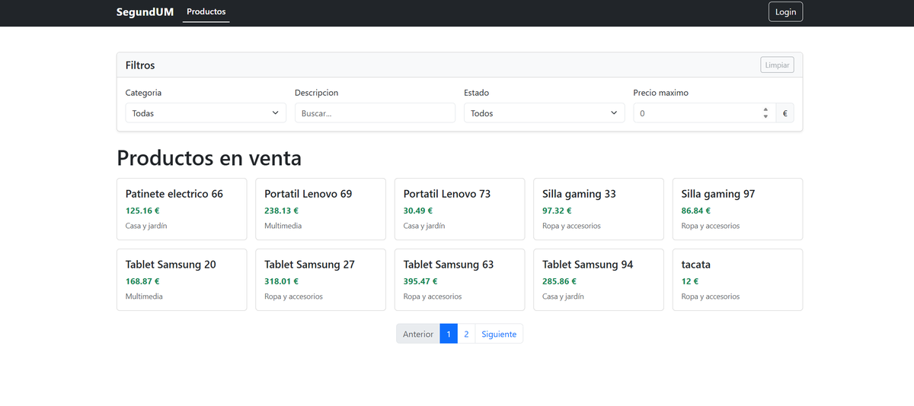
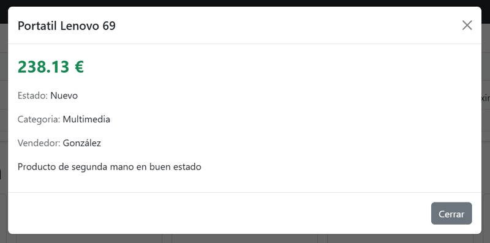
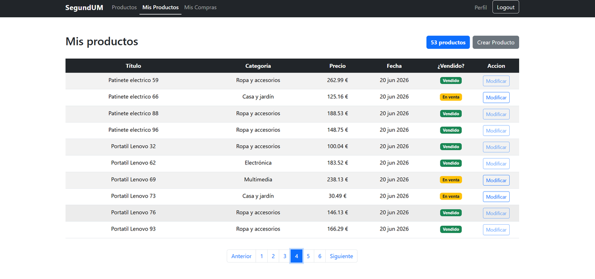

# SegundUM

Plataforma web de compraventa de productos de segunda mano. Los usuarios publican productos, los filtran por categoría, estado o precio, y los compran; un administrador puede ver todos los usuarios y todas las compraventas.

| Catálogo | Detalle de producto |
|---|---|
|  |  |



## Arquitectura

Monorepo con dos carpetas:

- **`backend/`**: microservicios detrás de una pasarela de API.
- **`frontend/`**: aplicación React y un pequeño servidor Express.

```
React (3000) ─▶ Express + Handlebars (3001) ─▶ Pasarela (8090) ─┬─▶ Usuarios      (8080, MySQL)
                  └ páginas de error                            ├─▶ Productos     (8081, MySQL)
                                                                ├─▶ Compraventas  (8082, MongoDB)
                                                                └─▶ Valoraciones  (8083, MySQL, .NET)
                                  Los microservicios se comunican por eventos con RabbitMQ
```

| Servicio | Tecnología | Qué hace |
|---|---|---|
| Pasarela | Spring Boot + Zuul | Punto de entrada. Autenticación con JWT y OAuth2 con GitHub. |
| Usuarios | Java, JAX-RS (Jersey) | Altas, consulta, modificación y baja de usuarios. |
| Productos | Spring Boot | Productos y categorías, con filtros y paginación. |
| Compraventas | Spring Boot | Registro y consulta de compras y ventas. |
| Valoraciones | .NET 8 | Valoraciones de las compraventas (opcional). |
| Frontend | React, Bootstrap, Express, Handlebars | Interfaz web y páginas de error (401, 403, 404, 500, 502). |

## Cómo arrancarlo

### Requisitos

- Docker con Docker Compose
- Node.js 18 o superior

### 1. Backend

```bash
cd backend
cp .env.example .env
```

Edita `.env` y rellena los valores:

| Variable | Para qué |
|---|---|
| `DB_PASSWORD` | Contraseña de MySQL y MongoDB. |
| `JWT_SECRET` | Clave con la que se firman los tokens JWT. Usa una cadena larga y aleatoria. |
| `GITHUB_CLIENT_ID`, `GITHUB_CLIENT_SECRET` | Solo para el login con GitHub; sin ellos funciona el login normal. |

Después levanta los servicios:

```bash
docker compose up -d --build
```

La primera vez tarda unos minutos porque compila todos los microservicios. Las bases de datos y RabbitMQ tienen *healthchecks*, y los servicios esperan a que estén listos antes de arrancar. Comprueba el estado con `docker compose ps`.

Para probar la API sin el frontend hay una colección de Postman en `backend/` (`Proyecto Segundum.postman_collection.json`).

#### Login con GitHub (opcional)

Crea una OAuth App en GitHub, en *Settings → Developer settings → OAuth Apps*. Usa `http://localhost:8090/login/oauth2/code/github` como *callback URL* y copia el *client id* y el *secret* en `.env`.

### 2. Frontend

Con el backend arrancado:

```bash
cd frontend
npm install
npm start
```

Abre http://localhost:3000. El desarrollo usa un proxy hacia la pasarela (8090).

Para ver la versión con el servidor Express y las páginas de error, que sirve la compilación de producción:

```bash
cd frontend
npm run build
cd server
npm install
npm start
```

Abre http://localhost:3001.

### Parar

```bash
cd backend
docker compose down        # añade -v para borrar también los datos
```

## Puertos

| Puerto | Servicio |
|---|---|
| 3000 | React (desarrollo) |
| 3001 | Express (proxy y páginas de error) |
| 8090 | Pasarela |
| 8080 / 8081 / 8082 / 8083 | Usuarios / Productos / Compraventas / Valoraciones |
| 15672 | Panel de RabbitMQ |
| 27017 | MongoDB |
